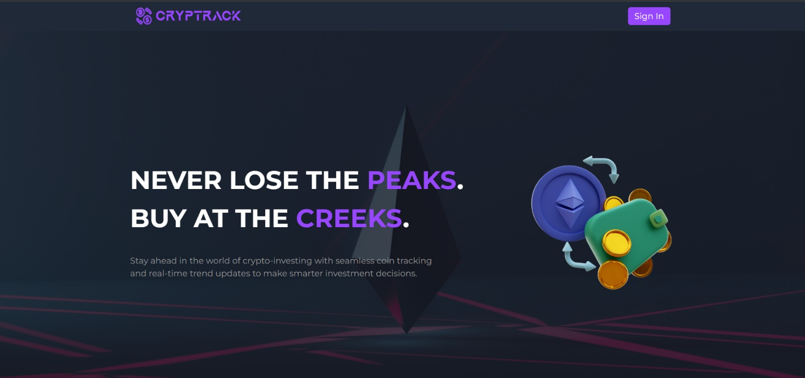
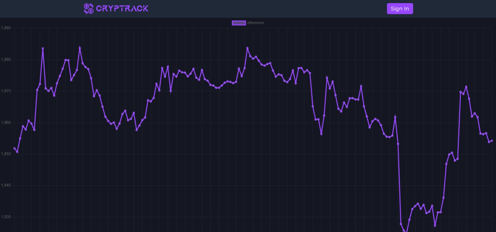
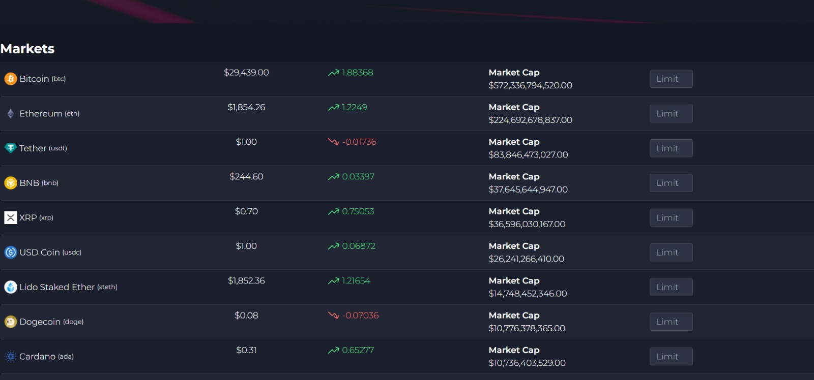

# Cryptrack 

## Description

Cryptocurrency Tracker App is a web application that allows users to track the current state of the cryptocurrency market, access historical data, and view charts based on the data fetched from the Gecko API.



## Features

- User Authentication: Firebase is used for user authentication, allowing users to sign up, log in, and access their personalized accounts.

- Real-time Data: The app uses the Gecko API to fetch real-time data on cryptocurrency prices, market capitalization, trading volume, and more.

- Historical Data: Users can access historical data for cryptocurrencies to analyze trends over time.

- Interactive Charts: React ChartJS is used to generate interactive and visually appealing charts based on the fetched data.

## Tech Stack

- ReactJS: Frontend library for building the user interface.
- Tailwind CSS: Utility-first CSS framework for responsive and customizable designs.
- Firebase: Backend as a Service (BaaS) for user authentication and database management.
- Gecko API: External API for fetching cryptocurrency data.
- React ChartJS: React wrapper for ChartJS, used to create interactive charts.
- Docker Compose: To build an image with the dependencies of the project to create and commence all configurations.

## Dependencies
- <a href="https://www.npmjs.com/package/react-chartjs-2" target="_blank">React ChartJS 2</a>
- <a href="https://www.npmjs.com/package/chart.js?activeTab=readme" target="_blank">Chart.js</a>
- <a href="https://www.npmjs.com/package/axios" target="_blank">Axios</a>
- <a href="https://www.npmjs.com/package/firebase" target="_blank">Firebase</a>
- <a href="https://www.npmjs.com/package/react-router-dom" target="_blank">React-Router-DOM</a>
- <a href="https://tailwindcss.com/docs/installation/using-postcss" target="_blank">Tailwind</a>
- <a href="https://drive.google.com/file/d/1-xlULFLhN1-A35PsKbQ_m602lDxIWT31/view?usp=sharing" target="_blank">Docker Image (Virtual Hard Disk v2)
  
  ```sh 
  npm install react-chartjs-2 chart.js moment react-router-dom firebase axios -D tailwindcss postcss autoprefixer
  ```
  
  
## Getting Started

### Prerequisites

- Node.js and npm must be installed on your machine.

### Installation

1. Clone the repository:
    ```sh 
    git clone https://github.com/TrojanPunk/Cryptrack.git
    ```

2. Install the dependencies.

3. Set up Firebase:
- Create a new Firebase project at https://console.firebase.google.com/
- Enable email/password authentication in the Firebase console.
- Obtain your Firebase config settings (API Key, Auth Domain, etc.) and add them to the appropriate files.

4. Set up Gecko API:
- Register for an API key at https://coinmarketcap.com/api/
- You do not need an API key for Gecko API. However, the server request failure rate is high.

5. Start the development server:

6. Open your browser and navigate to http://localhost:3000 to see the app in action.


## Captures
<table>
<tr>
  <td></td>
  <td></td>
  <td></td>
</tr>
<td></td>
  <td></td>
<td></td>
</table>

## Usage

1. Sign up or log in using your email and password.

2. Browse through the list of available cryptocurrencies to view their current data.

3. Access historical data by selecting a cryptocurrency and choosing a specific time range.

4. View the interactive chart for a visual representation of the selected cryptocurrency's performance.

## Contributing

Contributions are welcome! If you find any issues or have ideas for improvements, feel free to open an issue or submit a pull request.

The site is hosted at: <a href="https://thecryptrack.netlify.app/" target="_blank">https://thecryptrack.netlify.app/</a>

### User Authentication in this hosted version is not applicable as the server supports only static versions.